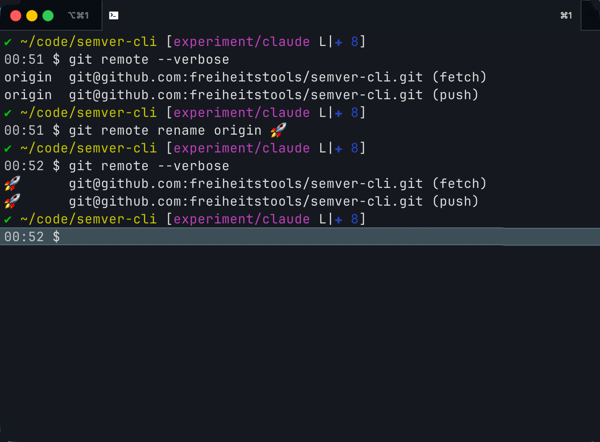

+++
draft = false
date = "2026-01-20T15:02:15+01:00"
title = "Emoji-Unterstützung in Git goes to the Moon"
description = "Git erlaubt die Verwendung von Emojis als Bezeichner für ein Remote-Repository."
keywords = ["git"]
slug = "Emoji-Unterstuetzung in Git goes to the Moon"
categories = ['Unicode', 'Fundstücke', 'Git']
+++

= Diese Überschrift wird ignoriert!!!

Zeichensätze und der korrekte Umgang damit sind eine der sieben Plagen der IT.
Die Leute hinter Git haben es richtig gemacht.
Schlußendlich ist ein Emoji auch nur eine Zeichenkette.
Genauer gesagt ist es eine Reihe von Unicode-Codepunkten.

Bitte fragt nicht, wie ich darauf gekommem bin, das auszuprobieren.
Ich vermute, dass es an der Uhrzeit lag.

.Mein Upstream-Repo "goes to the moon"

