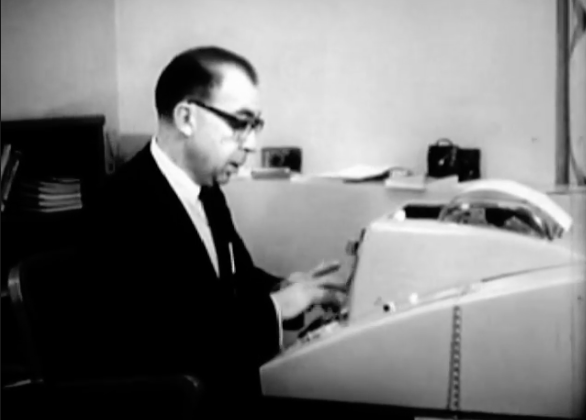

// Achtung! Die gerenderte Überschrift wird aus dem
// Front-Matter genommen.
// Grund dafür sind spezifische Anpassungen für das Theme
// Coder (Stand: 2026-01-22)
= Optionen, Argumente und Operanden: Standards für Command Line Interface
:stem: latexmath

Gerade arbeite ich an einem Vortrag über Command Line Clients in Java, motiviert durch die Möglichkeiten der Graal VM in Kombination mit dem riesigen Ökosystem der Java-Welt. Und wenn ich einen Vortrag ausarbeite, dann beschäftigt mich auch immer die Frage, warum etwas so ist, wie es ist und welche Geschichte dahinter steckt. Die Beschäftigung mit solchen Fragen hilft die Welt zu verstehen, was dazu geführt hat und ob die heutige Lösung immer noch die Antwort auf die Frage ist und ob die Frage sich überhaupt noch stellt.

Wer sich mit Command Line Clients beschäftigt, der kommt am Thema Optionen und Argumente nicht vorbei. Wer einen Vortrag hält oder generell anderen Wissen vermitteln will, der muss sich mit den Grundlagen beschäftigen, um Kontext zu bilden und Dinge richtig benennen zu können. Vom Vagen zum Konkreten. Also, was passiert da auf der Befehlszeile?

== Die Ursprünge

Die Nutzung eines Command Line Client, vereinfachend ab jetzt als Cli bezeichnet, setzt eine Befehlszeile voraus, über die wir  mit der Maschine Computer kommunizieren können. Vermutlich war das erste System, mit einer interaktiven Kommunikation über getippten Text Compatible Time-Sharing System (CTSS). Davor beherrschten Stapel-Systeme die Welt, in der Programme im Batch-Betrieb abgearbeitet wurden, ohne Möglichkeiten des Eingriffs oder der Interaktion mit einem Benutzer.

CTSS wurde am MIT entwickelt und basierte auf einen Memo von John McCarthy an Professor P.M. Morse,
footnote:[John McCarthy, MEMORANDUM TO P. M. MORSE PROPOSING TIME SHARING, https://www-formal.stanford.edu/jmc/history/timesharing-memo/timesharing-memo.html]
der zu der Zeit  Direktor des MIT Computation Center war, in dem er vorschlug ein Time Sharing System einzuführen, um Computer effizienter für die Entwicklung von Programmen nutzen zu können. Die Entwicklung eines Programmes beinhaltet immer einen Zyklus auf Entwicklung und Debugging. Dafür wurden geschriebene Programme beim Computation Center abgeben und nach bis zu 36 Stunden erhielt man da Ergebnis. Wenn sich mehrere Personen einen Rechner teilen könnten, könnte man diese Zeit auf 1 Sekunden reduzieren.

[quote,John McCarthy, MEMORANDUM TO P. M. MORSE PROPOSING TIME SHARING]
____
The response time of the MIT Computation Center to a performance request presently varies from 3 hours to 36 hours depending on the state of the machine, the efficiency of the operator, and the backlog of work. We propose by time sharing, to reduce this response time to the order of 1 second for certain purposes.
____

Dafür müsste ein Rechner mit einer Tastatur und einem Typewriter, quasi einer Schreibmaschine, ausgestattet werden.

[quote,John McCarthy, MEMORANDUM TO P. M. MORSE PROPOSING TIME SHARING]
____
Suppose that the programmer has a keyboard at the computer and is equipped with a substantial improvement on the TXO interro- gation and intervention program (UT3). (The improvements are in the direction of expressing input and output in a good programming language.) Then he can try his program, interrogate individual pieces of data or program to find an error, make a change in the source language and try again.
____

Interessanter Weise führt er als einen wesentlichen Faktor zur Verbesserung des, wie wir heute sagen würden, Entwicklungsprozesses an, dass wenn der Zyklus zwischen dem Schreiben, der Ausführung, der Fehlersuche und der Korrektur des Programmes verkürzt wird, der Programmier genau weiß, woran er gerade arbeitet und sich nicht erst mühsam an das erinnern muss, was er vor eineinhalb Tagen erarbeitet hat. Heute würde man vielleicht sagen, dass sein Kontextfenster noch aktuell ist.

Als CTSS dann im November 1961 eingeführt wurde, stand erstmals ein System zur Verfügung, mit dem interaktiv mit einem Computer gearbeitet werden konnte über die Eingabe von Befehlen.

=== Fernschreiber für die Befehlszeile

Seit damals hat sich die Befehlszeile konzeptionell nicht wesentlich verändert, doch in ihrem Auftreten schon. Anstatt von Tastatur und Bildschirm kam ein Fernschreiber zum Einsatz, über den der Benutzer seine Befehle eingeben und die Antworten vom Computer erhalten konnte.

Fernschreiber waren einen etablierte Technik und billig. Billig im Vergleich zur Alternative eines Monitors. Dabei war der Monitor selber nicht das Problem, sondern der für den Betrieb des Monitors notwendige Speicher. Ein Röhrenmonitor (Kathodenstrahlröhrenbildschirm) nutzt für die Erzeugung eines Bildes einen Elektronenstrahl, der beim Auftreffen auf einer Leuchtstoffschicht ein sichtbares Bild erzeugt. Da die Information selber damit verloren geht, müßte sie für eine Monitordarstellung dauerhaft in einem Speicher abgelegt werden. Da der dafür notwendige Speicher sehr teuer war, war das keine Option. Zudem bot die Mitschrift durch den Fernschreiber auch von jeder Sitzung ein Protokoll zu erhalten.

Auf https://www.youtube.com/watch?v=sjnmcKVnLi0[Youtube gibt es ein Video von Robert Fano^]footnote:[https://de.wikipedia.org/wiki/Robert_Fano] aus den frühen 1960er Jahren, in dem er die Nutzung von CTSS demonstriert, ungefähr ab Minute 5, des Videos.
Die folgenden Bilder sind diesem Video entnommen.

:fano_alt_1: Fano bei der Nutzung von CTSS über einen Fernschreiber

.{fano_alt_1}

:fano_alt_2: Die Tastatur des Fernschreibers für den Dialog mit CTSS

.{fano_alt_2}

:fano_alt_3: Ausdruck des Dialogs zwischen Fano und CTSS

.{fano_alt_3}

// https://claude.ai/share/385531ff-70b1-4fbe-b198-bc8e6f5c2d1a
//
//
// [stem]
// ++++
// \underbrace{\texttt{cp}}_{\text{Befehl}}\quad
// \underbrace{\texttt{-r}}_{\text{Option}}\quad
// \underbrace{\texttt{src/ dest/}}_{\text{Argumente}}
// ++++
//
//
//
// https://www.gnu.org/prep/standards/html_node/Command_002dLine-Interfaces.html
// https://gist.github.com/coolaj86/1759b70e72f038869b7bf87816d9dc2e
// the man and --help of ls, curl, tar, grep, and many others
// https://www.gnu.org/prep/standards/html_node/Command_002dLine-Interfaces.html
// https://www.gnu.org/prep/standards/html_node/Option-Table.html#Option-Table
// https://www.gnu.org/software/coreutils/manual/coreutils.html#Common-options
// https://www.man7.org/linux/man-pages/man3/getopt.3.html
// https://pubs.opengroup.org/onlinepubs/9799919799/
// https://tldp.org/LDP/abs/html/standard-options.html
// https://web.mit.edu/gnu/doc/html/standards_18.html

// todo Nimm beim Aufruf immer die lange Version, wenn es eine gibt

- Compatible Time-Sharing System (1961–1973). Fiftieth Anniversary Commemorative Overview, Washington, DC 2012
https://multicians.org/thvv/compatible-time-sharing-system.pdf
